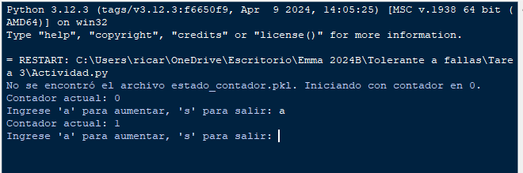
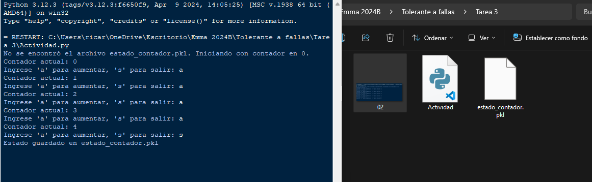
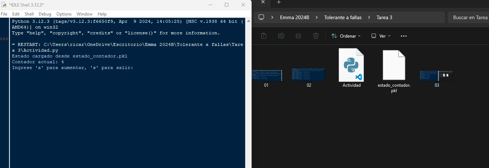

# Computacion-Tolerante-a-Fallas
## Valdivia Guerra Ricardo Emmanuel
# Generar un programa que sea capaz de restaurar el estado de ejecución

# libreria pickle 
El módulo pickle en Python permite serializar objetos Python en un formato que puede ser almacenado en un archivo y luego deserializado para recuperar el estado.

## Importar libreria 
ya viene en los paquetes de Python y solo se debe importar al programa 
```python
import pickle
```
## Funciones 
### Guardar Estado 
La función toma el valor del contador y lo guarda en un archivo usando pickle
```python
def guardar_estado(contador, nombre_archivo):
    with open(nombre_archivo, 'wb') as archivo:
        pickle.dump(contador, archivo)
    print(f"Estado guardado en {nombre_archivo}")
```
### Cargar Estado
La función intenta leer el archivo y deserializar el contador. Si el archivo no existe, inicia con un contador en 0
```python
def cargar_estado(nombre_archivo):
    try:
        with open(nombre_archivo, 'rb') as archivo:
            contador = pickle.load(archivo)
        print(f"Estado cargado desde {nombre_archivo}")
        return contador
    except FileNotFoundError:
        print(f"No se encontró el archivo {nombre_archivo}. Iniciando con contador en 0.")
        return 0
    except Exception as e:
        print(f"Error al cargar el estado: {e}")
        return 0
```
nota: Deserialización -> Convertir el formato guardado de vuelta en el estado original del programa
### Programa Principal
El programa trabajara con un bucle el cual hara incremento en una variable contador e imprime el estado actual del contador
se interactua con dosa apartados los cuales dependiendo de la tecla aumentara el contador y al cerrar el programa este podra recuperar su estado gracias al alrchivo llamado 'estado_contador.pkl'
```python
def main():
    nombre_archivo = 'estado_contador.pkl'
    contador = cargar_estado(nombre_archivo)
    
    while True:
        print(f"Contador actual: {contador}")
        accion = input("Ingrese 'a' para aumentar, 's' para salir: ").strip().lower()
        if accion == 'a':
            contador += 1
        elif accion == 's':
            guardar_estado(contador, nombre_archivo)
            break
        else:
            print("Acción no reconocida. Intenta de nuevo.")

if __name__ == "__main__":
    main()
```
### Ejecución 
Iniciamos el programa
### 
### Prueba
Este programa almacenara el contador y al cerrar creara el archivo de recuperacion
### 
Al volver a abrirlo este continuara donde se quedo el contador
### 
