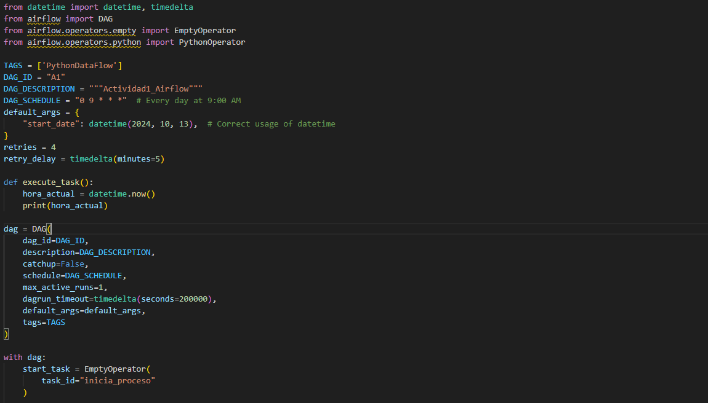
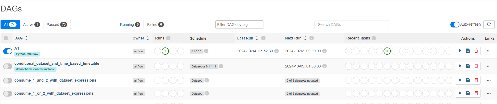
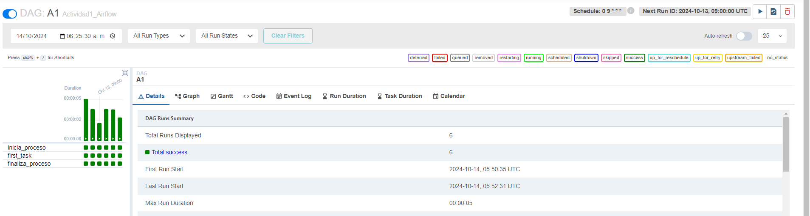
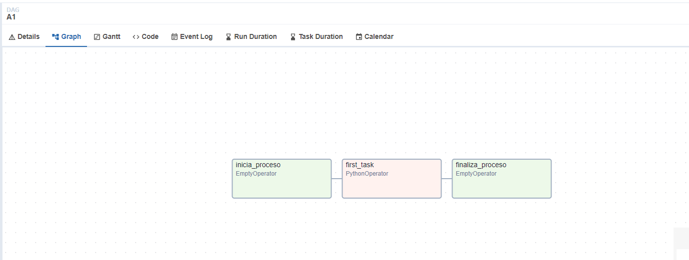
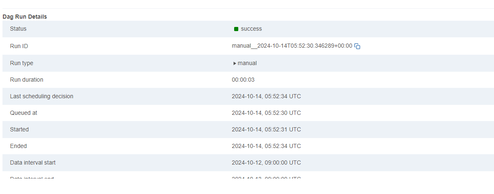
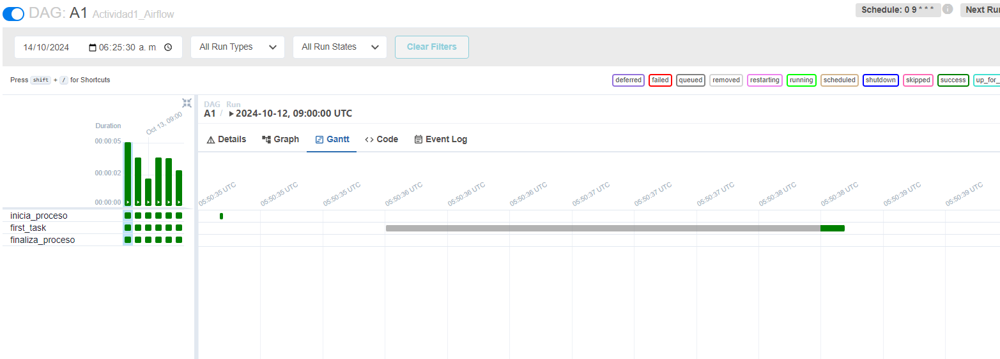
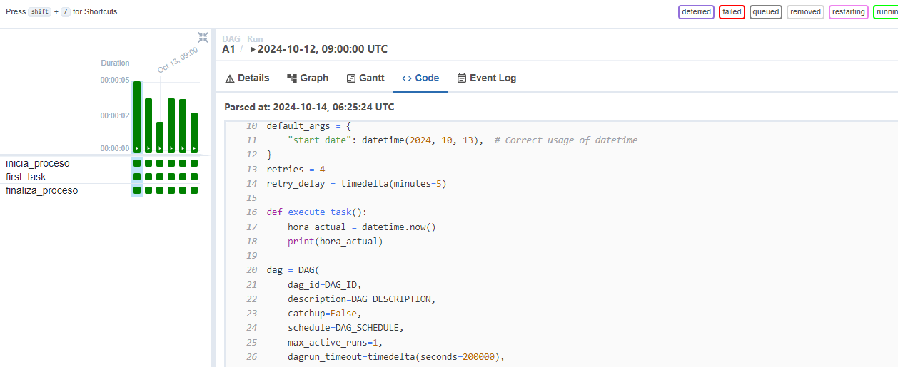

# Computacion-Tolerante-a-Fallas
## Valdivia Guerra Ricardo Emmanuel
# Ejemplo utilizando Airflow
## codigo
aqui nuestro codigo de ejemplo toma la hora actual y la imprime 
```python
hora_actual = datetime.now()
print(hora_actual)
```
este debe estar en nuestra plantilla de nuestro docker
### 
esta parte del codigo nos permite administrar cada cuanto tiempo se ejecutara el codigo
```python
TAGS = ['PythonDataFlow']
DAG_ID = "A1"
DAG_DESCRIPTION = """Actividad1_Airflow"""
DAG_SCHEDULE = "0 9 * * *"  # cada dia a las 9:00 AM
```
al iniciar nuetro aiflow podremos ver nuestros trabajos
### 
al abrir el nuestro podemos monitorizar nuestro programa 
### 
### 
### 
### 
### 
