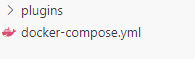
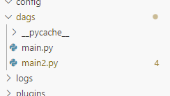
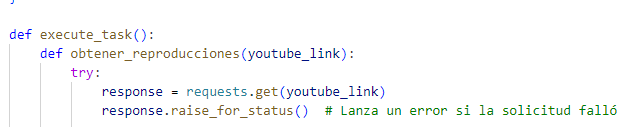
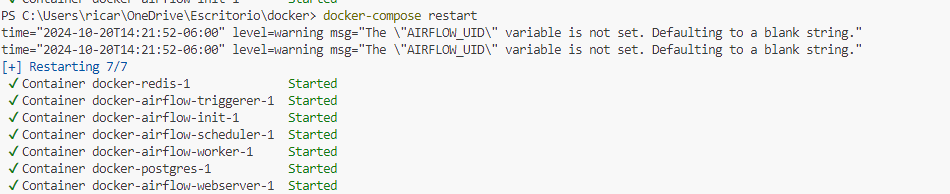
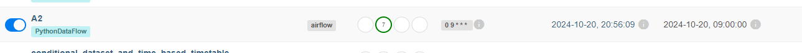
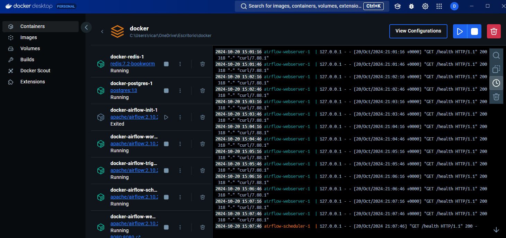
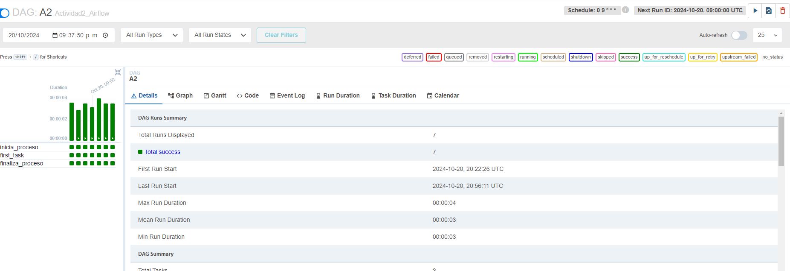
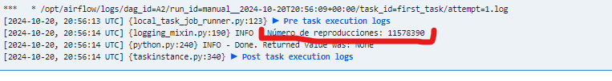

# Computacion-Tolerante-a-Fallas
## Valdivia Guerra Ricardo Emmanuel
# Ejemplo utilizando Docker
## Instalacion 
Al instalar el docker y abrir la dependencia con visual studio crearemos un archivo en la raiz llamado docker-compose.yml el cual implementara la infraesctructura y la configuracion de nuestro docker
### 
en este introduciremos la informacion necesaria dada por docker el cual cuenta tambien con sus datos de licencia 
cuando creamos nuestro archivo de .py en la carpeta "Dags" utilizaremos la estructura para poder monitorizarlo desde ApacheAirflow y ponemos la configuracion y nombre del programa  
### 
```python
ENV = Variable.get('env')
ID = Variable.get('id')
TAGS = ['PythonDataFlow']
DAG_ID = "A2"
DAG_DESCRIPTION = """Actividad2_Airflow"""
DAG_SCHEDULE = "0 9 * * *"  # Every day at 9:00 AM
default_args = {
    "start_date": datetime(2024, 10, 13),  # Correct usage of datetime
}
retries = 4
retry_delay = timedelta(minutes=5)
```
nuestro archivo se compone una estructura en la cual nuestro codigo a monitorizar se encontrara en el apartado 
def execute_task()
### 
## inizializar Docker
para esto ya teniendo los archivos necesarios, ejecutamos en una terminal nueva el comando "composer up", el cual inicializa el servicio de docker
### 
una vez echo esto podremos ver nuestro proyecto en aiflow
### 
con docker docker podra mostrar el flujo de trabajo 
### 
## Codigo
aqui nuestro codigo de ejemplo, este analiza la estrucxtura HTML de youtube y de un link predefinido toma la cantidad de vistas 
```python
def obtener_reproducciones(youtube_link):
        try:
            response = requests.get(youtube_link)
            response.raise_for_status()  # Lanza un error si la solicitud falló

            # Analizar el contenido HTML
            soup = BeautifulSoup(response.text, 'html.parser')

            # Buscar el elemento que contiene el número de reproducciones
            views = soup.find("meta", itemprop="interactionCount")['content']
            return views
        except Exception as e:
            print(f"Error al obtener datos: {e}")
            return None
    def main():
        youtube_link = "https://www.youtube.com/watch?v=a4na2opArGY&ab_channel=Crunchyroll"
        reproducciones = obtener_reproducciones(youtube_link)
        if reproducciones is not None:
            print(f"Número de reproducciones: {reproducciones}")
        else:
            print("No se pudo obtener el número de reproducciones.")
    main()
```
ya con esto podemos ver resultados y monitorizar nuestro programa con airflow como la actividad pasada 
### 
### 
