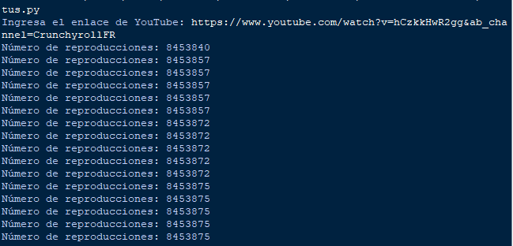

# Computacion-Tolerante-a-Fallas
## Valdivia Guerra Ricardo Emmanuel
# Realizar un programa que sea capaz de revisar el estado de tu aplicación

# libreria BeautifulSoup
El módulo pickle en Python analizar el contenido HTML de la página de YouTube.

## Importar libreria 
instalar la libreria desde cmd 
```python
pip install requests beautifulsoup4
```
## Funciones 
### obtener_reproducciones
Esta función recibe un enlace de YouTube y realiza una solicitud HTTP para obtener el contenido de la página. Usa BeautifulSoup para analizar el HTML y extraer el número de reproducciones del meta elemento correspondiente.
```python
def obtener_reproducciones(youtube_link):
    try:
        response = requests.get(youtube_link)
        response.raise_for_status()  # Lanza un error si la solicitud falló

        # Analizar el contenido HTML
        soup = BeautifulSoup(response.text, 'html.parser')

        # Buscar el elemento que contiene el número de reproducciones
        views = soup.find("meta", itemprop="interactionCount")['content']
        return views
    except Exception as e:
        print(f"Error al obtener datos: {e}")
        return None
```
### main
Solicita al usuario que ingrese un enlace de YouTube y luego entra en un bucle infinito que obtiene y muestra el número de reproducciones cada minuto. Si hay un error al obtener los datos, lo imprime en la consola
```python
def main():
    youtube_link = input("Ingresa el enlace de YouTube: ")
    
    while True:
        reproducciones = obtener_reproducciones(youtube_link)
        if reproducciones is not None:
            print(f"Número de reproducciones: {reproducciones}")
        else:
            print("No se pudo obtener el número de reproducciones.")
        # Esperar 60 segundos antes de actualizar
        time.sleep(60)

if __name__ == "__main__":
    main()
```
### Ejecución 
Iniciamos el programa y agregamos un link de youtube y este con una solicitud cada minuto actualizara en pantalla el valor del apartado del html seleccionado por la libreria 
### Prueba
### 
